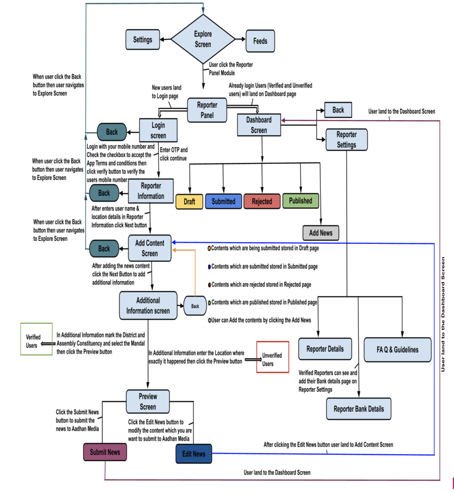

The Reporter Panel Module is a dedicated feature within our Aadhan short news app designed specifically for citizen reporters. This innovative module empowers users to contribute to the news-making process, turning everyday app users into active participants in journalism. As a Citizen Reporter within our Aadhan short news app, you are more than just a user; you are an integral part of our news reporting ecosystem. Your contributions can help shape the narrative, uncover truths, and bring diverse perspectives to the forefront. Whether it's breaking news, community events, or stories that haven’t yet caught the attention of mainstream media, your voice is vital.

### Responsibilities to follow as a reporter

1. **Reporting News:** Capture and report on events happening in your area. This can range from community events, accidents, and natural phenomena to larger, breaking news stories.
2. **Gathering Evidence:** Collect photos, videos, and firsthand accounts to support your stories, ensuring they are accurate and well-documented.
3. **Fact-Checking:** Ensure that the information you submit is truthful and verifiable. Misinformation undermines credibility and can have serious repercussions.
4. **Ethical Reporting:** Maintain high ethical standards in your reporting. Respect privacy, avoid sensationalism, and strive for unbiased, objective storytelling.
5. **Engagement:** Participate in discussions within the app, respond to comments on your reports, and engage with other users and professional journalists.

### Aadhan Features and Tools Availabilities to Reporters

1. **News Submission:** Users can submit news stories directly through the Aadhan short news app, including text, photos, and videos, making it easier to report on-the-go.
**Note :** We are limited to a maximum of 5 photos/videos attached to the submitted contents
2. **Editing Tools:** Integrated editing tools allow for basic enhancements and adjustments to submissions, ensuring clarity and impact.
3. **Real-Time Updates:** Reporters receive notifications on the status of their submissions, including editorial feedback and publication updates.
4. **Training & Resources:** Access to a library of resources for improving reporting skills, understanding journalistic ethics, and learning best practices in digital storytelling.
5. **Community Engagement:** A forum for reporters to discuss ideas, collaborate on stories, and share experiences and advice.

### Benefits to the Aadhan Reporters

1. **Platform for Voice and Visibility :** Reporters gain a platform to share their stories, insights, and perspectives, reaching a wide audience that might otherwise be inaccessible. This visibility can highlight local issues, influence public opinion, and even spur action.
2. **Skill Development and Experience :** Submitting news to the app provides an excellent opportunity for budding journalists to hone their skills in research, writing, photography, and videography. It's a practical way to build a portfolio and gain experience in the field of journalism.
3. **Community Engagement and Networking :** Reporters can engage with a community of like-minded individuals, including both fellow reporters and the broader audience. This network can be a source of support, collaboration, and feedback, offering valuable connections and opportunities.
4. **Impact and Change :** By highlighting stories that may not receive attention from mainstream media, reporters can shed light on important issues, contributing to societal awareness and change. Their reports can lead to community mobilization, policy changes, or aid in response to crises.
5. **Recognition and Credibility :** Outstanding contributions may be recognized by the app through features, awards, or other forms of acknowledgment. This recognition can build a reporter's credibility and reputation in the field of journalism and beyond.
6. **Educational Resources :** Aadhan short news app provides access to resources, workshops, or training for their reporters. These educational opportunities can improve their reporting skills, understanding of journalistic ethics, and knowledge of digital media.
7. **Real-time Reporting :** The immediacy of app-based reporting allows news to be shared quickly, often in real-time. This immediacy can be crucial during unfolding events, disasters, or emergencies, providing timely information to the public.
8. **Creative Freedom :** Unlike traditional media, citizen journalists on Aadhan short news app often enjoy more creative freedom. They can choose topics that interest them and present stories in unique ways, experimenting with narrative styles, multimedia elements, and interactive content.
9. **Monetary Compensation :** 
- **Pay-per-article :** Reporters receive a fixed amount for each article published.

- **Revenue Sharing :** Earnings are based on the revenue generated from their content, such as ad revenue or subscriptions attributed to their work.

- **Bonuses for Performance :** Additional compensation for articles that achieve high viewership, engagement, or meet specific quality criteria.

10. **Recognition and Awards :** 
- **Featured Articles :** Outstanding pieces could be featured prominently within the app or on social media, increasing visibility.

- **Awards and Certificates :** Recognition for exceptional contributions, such as "Reporter of the Month" or awards for investigative reporting.

11. **Community and Support :** 
- **Supportive Community:** Being part of a community of reporters and journalists for support, collaboration, and exchange of ideas.

- **Editorial Support:** Access to editorial feedback and assistance to improve their submissions.

12. **Legal Support :** 
- **Legal Assistance:** In certain cases, especially for investigative reporting, the app might offer legal support or advice if reporters face legal challenges related to their work.

### Reporter Panel function flow in user end

### Steps to use Reporter Panel From user end

**Step 1 :** Start

**Step 2 :** User launch the Application

**Step 3 :** User land in the Aadhan Splash Screen

**Step 4 :** User land to Language Screen

**Step 5 :** User select the Language (English, Telugu, Hindi or Tamil)

**Step 6 :** User land to the language selected Feeds Screen

**Step 7 :** User in the Feeds Screen

**Step 8 :** User Swipe to right/tap Hamburger menu to move to Explore Screen

**Step 9 :** User in the Explore Screen

**Step10 :** User find the Reporter Panel Module in the Explore Screen

**Step 11:** User open the Reporter Panel

**Step 12 :** User land on the Reporter Panel

**Step 13 :** If user new to App, user have to Login with their Mobile Number

**Step 14 :** User received the OTP to the registered Mobile number after verification user land to the Add Content Screen on the Reporter Panel

**Step 15 :** User Fill the data on the Title Box and Description Box then add the related Category to that content and upload the Photos/Videos to that content then click the Next button

**Step 16 :** User land to the Additional Information Screen

**Step 17 :** User add the Location where the incident happened then click the Preview button

**Step 18 :** User land on the Preview Screen

**Step 19 :** Users can see Edit News and Submit News buttons on the Preview Screen.
Here User can modify the content by clicking the Edit News button. After clicking the Edit News button again user lands to Add Content Screen then modify the content and click the Next button then user land to the Additional Information Screen add the Location where the incident happened and click the Preview button and user land in Preview Screen

**Step 20 :** User click the Submit News button

**Step 21 :** User land on the Dashboard Screen

**Step 22 :** User can see the Draft, Submitted, Rejected and Published Pages on the Dashboard Screen and also user can see the Add Content icon on the bottom of the Dashboard screen from the Draft, Submitted, Rejected and Published Pages

**Step 23 :** User can see submitted contents in the Submitted Page on the Dashboard Screen

**Step 24 :** User can see Rejected contents in the Rejected Page on the Dashboard Screen

**Step 25 :** User can see Published content in the Published Page on the Dashboard Screen

**Step 26 :** User can see the Reporter Settings on the top right side on the Dashboard Screen

**Step 27 :** User open the Reporter Settings from the Dashboard Screen

**Step 28 :** User land on the Reporter Details Page Reporter Information Screen

**Step 29 :** User can see the Reporter Details, Reporter Bank Details and Guidelines & FAQ Pages on the Reporter Information Screen
Here only verified reporters can see the Reporter Bank Details Page on the Reporter Information Screen

**Step 30 :** User can navigate Back to the Dashboard Screen by clicking the Back Navigation on the top of the Reporter information Screen
